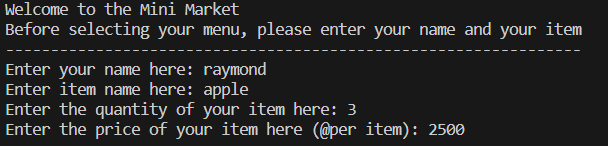

# Python Project: Mini Market System for Transactions

### A. Requirements / Objectives
This program is called as Mini Market System for self service cashier, where it can be used as a simple transaction while in a mini market to do a self service cashier. This program being created to solve the transaction process in a mini market, from adding items into basket, update items in the basket, remove item(s) in the basket, until calculating the total price of all items in the basket.

The program initially need a field of cust_name for customer name while shopping, item_name for first item added into the basket, item_qty for the quantity of the first item added, and item_price for the price of per item quantity.

### B. Flowchart of the Program
#### B.1 First step
First step we need to input the name of the user (cust_name), item name (item_name), item quantity (item_qty), and item price (item_price) to make the ID of transaction.

#### B.2. Second step
Second step, if we want to add more item into our shopping list, so we need to input the confirmation (yes or no), item name (item_name), item quantity (item_qty), and item price (item_price).

#### B.3. Third step
Third step, there is a mistake on putting the name of the item. We need to input the confirmation (yes or no), item index (obj_update: 1 and above), item name (item_name).

#### B.4. Fourth step
Fourth step, there is a mistake on putting the quantity of the item. We need to input the confirmation (yes or no), item index (obj_update: 1 and above), item quantity (item_qty).

#### B.5. Fifth step
Fifth step, there is a mistake on putting the price of the item. We need to input the confirmation (yes or no), item index (obj_update: 1 and above), item price (item_price).

#### B.6. Sixth step
Sixth step, we want to delete one of selected items in our shopping list, so we need to input the confirmation (yes or no) and item index (obj_delete: 1 and above). 

#### B.7. Seventh step
Seventh step, we want to reset all of our transaction in our shopping list, so we need to input the confirmation (yes or no) in order to empty the shopping list.

#### B.8. Eighth step
Eighth step, we want to check all of our items in our shopping list.

#### B.9. Ninth step
Ninth step, we want to check the total price of all our items in our shopping list and will be applied with discount if the total price meet the discount requirement.

### C. Code Description
There are 2 code script to complete the process of mini market's self service cashier, while _main.py_ as the main script to do the self service transaction, and _transaction.py_ as the collection of function to complete the action for user.

Below this paragraph, there will be explanations for every function saved in _transaction.py_
#### C.1. Function add_item

In this add_item function, used for add more items into the shopping basket. There are 4 parameters to run this function; confirmation, item_name, item_qty, and item_price. If the confirmation given is yes, the process will continue to fill out the item_name, item_qty, and item_price for saving into shopping list / basket (detail_item). If the answer is no, it will return to the last shopping list / basket (detail_item).

#### C.2. Function update_item_name

Function update_item_name is used to update the selected item for it's name. In this function, there are 3 parameters to run this function; confirmation, obj_update, and item_name. If the confirmation given is yes, the process will ask which item wants to be updated (obj_update) with number of index start from 1 and above, and then continue to item_name to completely change the item_name in selected item on the basket (detail_item), it will return to save into shopping list / basket (detail_item). If the answer is no, it will return to the last shopping list / basket (detail_item).

#### C.3. Function update_item_qty

Function update_item_qty is used to update the selected item for it's quantity. In this function, there are 3 parameters to run this function; confirmation, obj_update, and item_qty. If the confirmation given is yes, the process will ask which item wants to be updated (obj_update) with number of index start from 1 and above, and then continue to item_qty to completely change the item_qty in selected item on the basket (detail_item), it will return to save into shopping list / basket (detail_item). If the answer is no, it will return to the last shopping list / basket (detail_item).

#### C.4. Function update_item_price

Function update_item_price is used to update the selected item for it's price. In this function, there are 3 parameters to run this function; confirmation, obj_update, and item_price. If the confirmation given is yes, the process will ask which item wants to be updated (obj_update) with number of index start from 1 and above, and then continue to item_price to completely change the item_price in selected item on the basket (detail_item), it will return to save into shopping list / basket (detail_item). If the answer is no, it will return to the last shopping list / basket (detail_item).

#### C.5. Function delete_item

Function delete_item is used to delete item on selected item in the shopping list / basket (detail_item). To complete this function, there are 2 parameters to run this function; confirmation and obj_delete. If the confirmation give is yes, the process will continue to ask which item wants to be deleted. Selection of which item wants to be deleted using number of index, with the start of number 1 and above. After have choosen which item want to be deleted, it will return to save into shopping list / basket (detail_item). If the answer is no, it will return to the last shopping list / basket (detail_item). 

#### C.6. Function reset_transaction

On this function, reset_transaction is used for reset all items that have been added on the shopping list / basket (detail_item), by mean this function is used to empty the shopping list / basket (detail_item). To complete this function, there is a confirmation needed to be answered by user. If the confirmation is yes, it will return the empty shopping list / basket (detail_item), and if the confirmation is no, it will return the latest shopping list / basket (detail_item).

#### C.7. Function check_order

On this function, check_order is used for checking all items that have been added into the shopping list. This function will return all of the items with it's name, quantity, and price. In order to make user friendly for this program, items showed will be seen in a simple table.

#### C.8. Function total_price

On this function, total_price is used for checking the final price to be paid for finishing the transaction. In this function, the price will be automatically truncated based on the discount.

If the price is greater than equal of Rp 200.000, will have a discount of 5%, if the price is greater than equal of Rp 300.000, will have a discount of 8%, and if the price is greater than equal of Rp 500.000, will have a discount of 10%.

### D. Conclusion / Future Work
#### D.1. Start Menu
To start the program, we need to run the _main.py_ as our main program, while the function needed in _main.py_ imported from the class in _transaction.py_

In order to initialize the program, we need the input value of cust_name (customer name), item_name, item_qty (item quantity), and item_price.

#### D.2. Add more item
In the start menu of the program after all values have been inputted, there will be menu number 1 (one), while selecting the menu will use typing method with "1".

After the add item menu have been selected, there will be a confirmation between y/n (yes or no), if we select yes, the program will ask the name of the item, quantity of the item, and price of per item quantity.

#### D.3. Update item name
In this menu, we can update the item name of the items that being added into the basket, in example we could update item name of our first item into the desired item's name.

After being selected, the program will ask the confirmation between y/n (yes or no) and then which item want to be updated (index started from 1 and above), and the new name want to be updated into selected item.

#### D.4. Update item quantity
In this menu, we can update the item quantity of the items that being added into the basket, in example we could update item quantity of our first item into the desired item's quantity.

After being selected, the program will ask the confirmation between y/n (yes or no) and then which item want to be updated (index started from 1 and above), and the new quantity want to be updated into selected item.

#### D.5. Update item price
In this menu, we can update the item price of the items that being added into the basket, in example we could update item price of our first item into the desired item's price.

After being selected, the program will ask the confirmation between y/n (yes or no) and then which item want to be updated (index started from 1 and above), and the new price want to be updated into selected item.

#### D.6. Delete item
In the menu of delete item from this program allow us to delete selected item on our shopping list. After being selected, the program will ask the confirmation to delete item or not with the input of y/n (yes or no), and then it will be completely delete if we select which item want to be deleted from the list.

#### D.7. Reset item
Reset item menu will allow us to reset all of the items in our shopping list. In order to prevent any miss selection of the menu, the program will ask the confirmation to the user if all of the items want to be reset or not with confirmation between y/n (yes or no).

#### D.8. Check all items
On this menu, will allow us to check all of the items being added to our shopping list before. The program will visualize it into the table for easier checking.

##### D.9. Check total price
On this menu, the program will show to us how much we need to pay for the transaction have been done. It will apply some discount if the price fulfilled the requirement of discount. Preferably this menu selected while we want to finish our transaction from the mini market.

